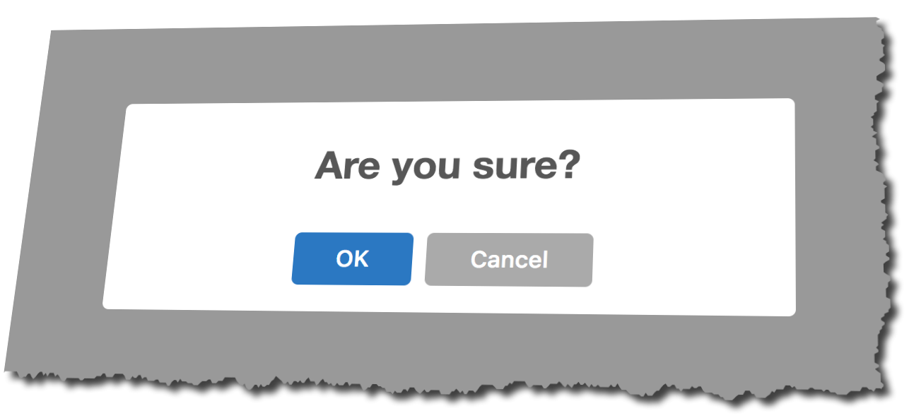
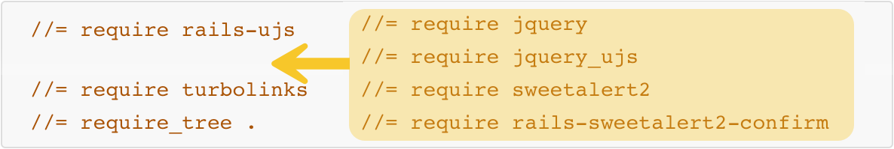
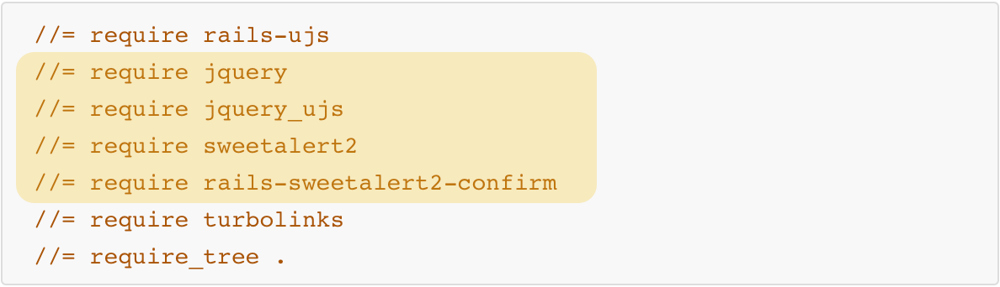

# SweetAlert2 in Rails 5.1+

자바스크립트 팝업창은 웹브라우저마다 다르게 보일 뿐 아니라 뭐 그리 미관적으로도 탐탁치 않다. 

이를 대체할 수 있는 자바스크립트 라이브러리로 **SweetAlert** 라는 것이 있는데, 현재 업그레이드 버전인 **SweetAlert2**가 출시되어 있다. 이 글에서는 **SweetAlert2** 사용법에 대해서 다룬다.

> **참고**: **SweetAlert** 사용법에 대해서는 이 링크(https://withrails.com/2017/12/11/sweetalert_for_rails_5-0-x/)가 도움이 될 것이다.

자바스크립트의 alert() 함수 호출할 때나 data-confirm 속성이 지정된 링크를 클릭했을 때 나타나는 팝업창을 생각하면 쉽게 알 수 있다.

이 자바스크립트 팝업창을 이쁘게 그리고 반응형으로 보이도록 하고 여러가지 추가옵션을 지정할 수 있는 자바스크립트 라이브러리를 찾는다면 바로 **SweetAlert2** 가 제격이다. 

https://limonte.github.io/sweetalert2/

**레일스 5.1 <u>이전</u> 버전**에서는 디폴트로 **jquery**, **jquery_ujs** 를 사용하도록 되어 있어 **jquery** 의존성을 가지는 **SweetAlert2** 를 레일스에서 사용할 때 문제가 없어야 한다. 테스트를 위해 프로그젝트를 다름과 같이 새로 작성한다.

```sh
$ rails _5.0.6_ new sweetalert2_rails506 && cd sweetalert2_rails506
```

그리고 아래의 두 젬을 Gemfile에 추가하고 번들 인스톨한다. 

```ruby
gem 'sweetalert2'
gem 'rails-sweetalert2-confirm'
```

**application.js**

```js
//= require jquery
//= require jquery_ujs
//= require sweetalert2
//= require rails-sweetalert2-confirm
//= require turbolinks
//= require_tree .
```

**application.css**
```css
 *= require sweetalert2
 *= require_tree .
 *= require_self
```

**application.scss**
```scss
@import 'sweetalert2'
```


**Post** 리소스를 아래와 같이 **scaffolding**하고 `db:migrate` 한다.

```sh
$ rails g scaffold Post title content:text
```

```sh
$ rails db:create && rails db:migrate
```

이제 서버를 시작을하고 브라우저에서 접속한다. 

```sh
$ rails s -p 3000
```

http://localhost:3000/posts 로 접속한 후 **post** 를 하나 생성한다. 그리고 방금 생성한 **post** 를 삭제하면 다음과 같은 자바스크립트 팝압창이 보이게 된다. 



Voila~

이제 레일스 5.1+ 버전에서 **SweetAlert2** 를 사용해 보자. 

루비 2.4.2 / 레일스 5.1.4

```sh
$ rails _5.1.4_ new sweetalert2_rails514
```

레일스 5.1+ 버전에서는 jquery 가 디폴트에서 빠졌있기 때문에 jquery 의존성을 가지는 SweetAlert2 를 사용하기 위해서는 jquery-rails 젬을 Gemfile 에 추가하고 번들 인스톨해야 한다. 

```ruby
gem 'jquery-rails'
gem 'sweetalert2'
gem 'rails-sweetalert2-confirm'
```

application.js



필요한 자바스크립트 라이브러리를 순서에 주의해서 추가한다. 



> **노트** : **Bootstrap** 을 사용할 때도 **jquery** 가 필요하다. 

**application.css**

```css
 *= require sweetalert2
 *= require_tree .
 *= require_self
```

**rails-sweetalert2-confirm-defaults.js** 파일을 아래와 같이 작성하고,

```js
var sweetAlertConfirmDefaults = {
  title: '계속하시겠습니까?',
  type: 'success',
  showCancelButton: true,
  confirmButtonText: "예",
  cancelButtonText: "아니요",
  confirmButtonClass: 'btn btn-danger'
  cancelButtonClass: 'btn btn-default',
};
```

위에서 `type` 속성 값은 다음과 같다. 


이 파일은 아래와 같이 둘 사이에 위치시킨다.

```js
//= require sweetalert2
//= require rails-sweetalert2-confirm-defaults    <=== 여기로 추가한다.
//= require rails-sweetalert2-confirm
```


# jQuery의 추방

레일스가 5.1 버전부터는 **jquery**를 디폴트로 지원하지 않게 되므로써 **jquery** 의존성을 가지는 **jquery_ujs** 대신 **rails-ujs** 드라이버를 사용하게 되었다. 

그렇다면 이전의 **jquery_ujs** 드라이버는 어떤 기능을 가졌는지 알아 보자. 


## Unobtrusive Javascript

***레일스*** **버전 3**부터 **unobstrusive javascript** 란 기법이 도입되었다.  레일스를 처음 접하는 초급자의 경우 이 단어에 사전적 의미는  이해하더라도 이 기법의 정확한 의미는 이해하지 못할 것이다. 

obtrude 란 단어의 뜻을 찾아보면 "**본의 아니게 끼어들다**" 라는 의미의 동사다. 이 단어의 형용사형은 **obtrusive**. "**보기 싫게 눈에 띄는,  두드러진**" 이란 의미다. 반의어는 **unobtrisive**. 그러니까 눈에 보이지 않도록 하여 보기에 좋다는 의미 쯤 될 것 같다. 더 풀어서 설명하자면 HTML 본문에서 자바스크립트 코드를 별도로 빼내어 보이지 않도록 한다는 것이다. CSS를 연상하면 쉽게 이해가 갈 것이다. HTML 본문 중에 있는 CSS 스타일을 별도의 스타일시트 파일로 분리하여 작성할 수 있는 것과 같은 원리로 연상할 수 있다. 이제 이쯤해서 왠만하면 이해가 갈 것이다. ^^

결국, **jquery ujs** 란 **jquery**라는 자바스크립트 라이브러리를 이용하여 이와 같은 작업을 쉽게 할 수 있도록 해 주는 역할을 한다고 생각하면 될 것 같다. 

실제로 jquery ujs가 하는 역할은 일정한 조건을 갖춘 엘리먼트에게 특정 이벤트를 처리할 수 있는 기능을 제공해 주는 것이다. 

대개는 엘리먼트 속성 중에 "**data-**" 로 시작하는 커스텀 속성을 이용하여 이벤트 핸들러를 호출하도록 해 준다. 

### 1) HTTP 메소드 링크

일반적으로 임의의 링크를 클릭하면 HTTP **GET** 요청을 하게 된다. 그러나 그냥 데이터만 불러오지 않고 특정 리소스에 대해서 어떤 동작을 호출하도록 하기 위해서는 GET 이외의 <u>다른 HTTP 메소드</u>(**POST**, **PUT**, **DELETE**)를 명시적으로 지정해 주어야 한다.  

```erb
<%= link_to 'Delete', post, method: :delete %>
```

위의 **erb** 코드는 다음과 같이 렌더링될 것이다.

```html
<a href="/posts/123" data-method="delete">Delete</a>
```

생성된 라우트를 보면 같은 **URI 패턴**을 갖더라도 **HTTP verb**(GET, PATCH, PUT, DELETE)에 따라 각기 다른 액션과 연결된다는 것에 주목하자. 

```sh
$ rake routes
    Prefix Verb   URI Pattern               Controller#Action
      post GET    /posts/:id(.:format)      posts#show
           PATCH  /posts/:id(.:format)      posts#update
           PUT    /posts/:id(.:format)      posts#update
           DELETE /posts/:id(.:format)      posts#destroy    <=== Note
```

> **노트** : **GET** 은 디폴트 메소드이므로 별도의 method	를 지정할 필요가 없다.

위의 링크를 클릭할 때 링크 동작을 수행하는 대신, jquery ujs 는 일시적으로 폼을 생성하여 '**_method**' 이라는 hidden INPUT 으로 data-method 속성에 지정된 값을 넘겨 주고 href 에 지정된 주소로 폼 서밋을 하도록 한다. 

### 2) Confirm 팝업창

**jquery ujs** 는 **data-confirm** 속성을 가지는 링크나 폼에 대해서 <u>자바스크립트 **confirm** 팝업창</u>를 호출하도록 해 준다. 

```erb
<%= form_for post, data: { confirm: 'Are you sure?' } do | f | %>

···

<% end %>
```

위의 **erb** 코드는 다음과 같이 렌더링될 것이다.

```html
<form class="new_post" id="new_post" data-confirm="Are you sure?" action="/posts" accept-charset="UTF-8" method="post">
  <input name="utf8" type="hidden" value="✓" />
  <input type="hidden" name="authenticity_token" value="oPD5Mmb4YQn17YD3sk7ZpQWfgcxNpm1GkvPyeBeUGfLqw==" />
```

### 3) 링크와 버튼 더블 클릭 방지

**jquery ujs** 덕분에 특정 링크 또는 버튼을 실수로 더블 클릭하는 것을 방지할 수 있다. 링크나 버튼이 **data-disable-with** 속성을 가질 경우 사용자가 실수로 요청을 두번하는 실수를 방지할 수 있게 된다. 즉 첫번째 클릭 후 링크나 버튼이 사용불가능 상태로 상태가 변경되어 두번째 클릭이 실행되지 않게 된다. 

```erb
<%= form.submit data: { disable_with: 'Submitting...' } %>
```

위의 **erb** 코드는 다음과 같이 렌더링될 것이다.

```html
<input type="submit" name="commit" value="Create Post" data-disable-with="Submitting...">
```

### 4) AJAX 폼

**form_for** 헬퍼 메소드에 **remote: true** 옵션을 지정한 후 폼 서밋하면(**data-remote="true"**), **jquery ujs** 가 AJAX 로 요청되도록 처리한다. 이 때 컨트롤러는 해당 AJAX 요청을 처리한 후 응답으로 보낼 자바스크립트(예, create.js.erb, update.js.erb)를 반환해 준다. 

```erb
<%= form_for item, remote: true %>
```

위의 **erb** 코드는 다음과 같이 렌더링될 것이다.

```html
<form class="new_post" id="new_post" action="/posts" accept-charset="UTF-8" data-remote="true" method="post">
  <input name="utf8" type="hidden" value="✓">
</form>
```

### 5) AJAX 파일 업로드

브라우저는 원래 **AJAX** 파일 업로드를 지원하지 않는다. 따라서 파일 **input**을 포함하는 **AJAX** 폼을 서밋할 경우 **jquery ujs**는 <u>***ajax:aborted:file*** 이벤트를 호출</u>하여 **AJAX** 서밋을 취소하고 일반 폼으로 서밋되도록 한다. 따라서 이 이벤트를 중단하도록 해야 **AJAX** 서밋이 성공하게 되는데, [**Remotipart**](http://rubygems.org/gems/remotipart) 젬을 이용하면 **AJAX** 파일 업로드를 할 수 있게 된다. 

### 6) Required 필드 유효성검증

**HTML5** 에서는 **input** 태그에 **required** 속성을 지정할 수 있도록 하여, 값을 입력하지 않고 서밋할 경우 서밋을 중단하고 해당 input 필드에 대해서 필수항목임을 표시하기 위해서 브라우저 고유의 스타일링을 적용하도록 하고 있으나 모든 브라우저에서 완벽하게 지원하고 있지는 않다. 따라서 **jquery ujs** 는 자바스크립트가 실행되는 모든 브라우저에서 **required** 필드 유효성 검증이 정상적으로 동작할 수 있도록 **polyfill** 을 제공해 준다. 이 때 스타일링은 제외된다. 한편, 폼에 **novalidate** 속성을 지정하면 **jquery ujs** 동작 뿐만 아니라 브라우저 고유의 스타일링 기능까지 가능케하는 **required** 기능을 중단한다.  

### 7) CSRF Protection

**CSRF**란 사용자를 속여 자신이 이미 로그인 되어 있는 애플리캐이션으로 임의의 요청을 하도록 하는 공격기법을 말한다. 사용자는 이메일 뉴스레터에 등록하는 것으로만 간단하게 생각할 수 있지만, 실제로는 현재의 세션 중에 사용자가 다른 사이트로 요청을 하도록 공격자가 등록 폼을 조작할 수 있다. 

레일스는 이런 공격을 차단하는 [보호장치를 내장](http://guides.rubyonrails.org/security.html#cross-site-request-forgery-csrf)하고 있는데, 매번 **POST**, **PUT**, **DELETE** 요청할 때마다 실제 사이트에서만 제공하는 **토큰**을 요구하도록 한다. 레일스 애플리케이션 레이아웃 **HEAD** 태그 내에 `<%= csrf_meta_tags %>` **erb** 코드를 추가한 상태에서 **jquery-ujs**가 외부로 나가는 **AJAX** 요청에 대해서 헤더에 **CSRF**용 토큰을 추가하여 보호 기능을 보완해 준다. 

또한 **jquery-ujs**는, **fragment** 캐시로부터 폼이 만들어져 시점이 오래된 경우에도, 페이지 로드시에 **AJAX** 가 아닌 모든 일반 폼에 대해서 **CSRF**용 토큰을 새로 만들어 준다. 

### 8) 확장성

**jquery-ujs**는 자신의 함수를 `$.rails` 라는 네임스페이스 내에 두고 있으며 **AJAX** 폼을 서밋할 때 [여러가지 이벤트](https://github.com/rails/jquery-ujs/wiki/ajax)를 발생하도록 한다. 이러한 **jquery-ujs**의 동작은 이런 함수들을 오버라이드하거나 적당한 이벤트를 처리하도록 하여 얼마든지 변경할 수 있다. 이와 같은 이벤트 처리를 변경하는 방식의 **Remotipart** 젬을 이미 위에서 소개한 바 있다. 또한 `$.rails.allowAction`  함수를 오버라이드해서 자바스크립트 **Confirm** 대화창을 애플리케이션 전용 모달(Modal) 대화창으로 바꿔주는 젬들도 몇가지 찾아 볼 수 있다. 


*References:*

- https://robots.thoughtbot.com/a-tour-of-rails-jquery-ujs
- http://blog.4geeks.io/2017/07/goodbye-to-jquery-as-dependency-on-rails.html
- https://blog.bigbinary.com/2017/06/20/rails-5-1-has-dropped-dependency-on-jquery-from-the-default-stack.html

